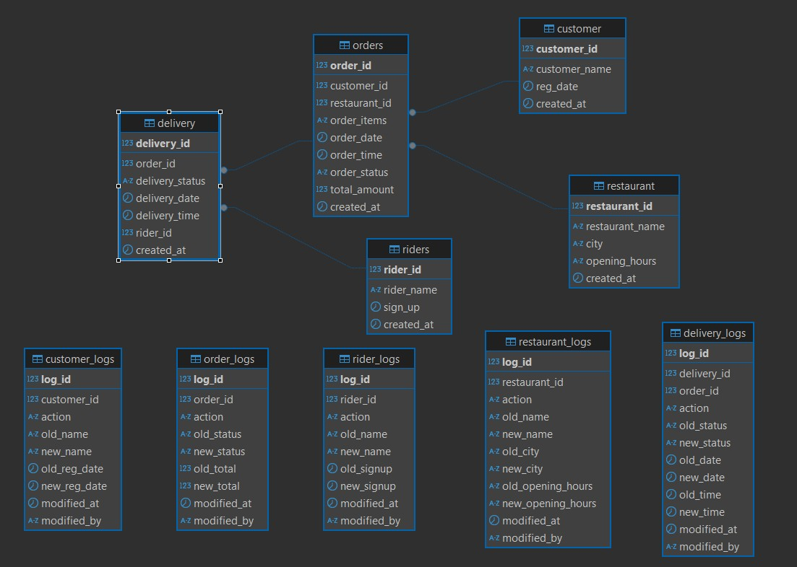

# Zomato-like Food Delivery Database & Analytics (PostgreSQL)

## Project Overview

**Project Title**: Zomato Analysis  
**Level**: Advanced  

This project provides a PostgreSQL database schema designed for a food delivery platform, similar in concept to Zomato or Swiggy. It includes table definitions, relationships, an robust auditing/logging mechanism using triggers, and a comprehensive set of analytical SQL queries to derive business insights. This repository also includes scripts & sql files for generating sample data.


## Table of Contents

1.  [Overview](#overview)
2.  [Features](#features)
3.  [Database Schema](#database-schema)
    *   [Entity Relationship Diagram (Conceptual)](#entity-relationship-diagram-conceptual)
    *   [Core Tables](#core-tables)
        *   [`customer`](#customer-table)
        *   [`restaurant`](#restaurant-table)
        *   [`orders`](#orders-table)
        *   [`riders`](#riders-table)
        *   [`delivery`](#delivery-table)
    *   [Log Tables](#log-tables)
4.  [Auditing & Logging Mechanism](#auditing--logging-mechanism)
5.  [Database Indexes](#database-indexes)
6.  [Analytical Queries & Reports](#analytical-queries--reports)
7.  [Prerequisites](#prerequisites)
8.  [Setup & Usage](#setup--usage)
9.  [Future Enhancements](#future-enhancements)
10. [Contributing](#contributing)
11. [License](#license)

## Overview

The database is designed to manage key entities in a food delivery ecosystem: customers, restaurants, orders, riders, and deliveries. It ensures data integrity through constraints and primary/foreign keys. A significant aspect of this project is the implementation of a detailed logging system that tracks all INSERT, UPDATE, and DELETE operations on core tables, providing a valuable audit trail. Furthermore, the project includes 20 advanced analytical queries that demonstrate how to extract actionable insights from the data. Sample data generation scripts are also provided directly in this document to facilitate testing and exploration.

## Features

*   **Comprehensive Schema:** Models essential entities for a food delivery service.
*   **Data Integrity:** Uses primary keys, foreign keys, `NOT NULL`, and `CHECK` constraints.
*   **Automatic Timestamps:** `created_at` and `modified_at` fields use `TIMESTAMPTZ` for time zone-aware timestamping.
*   **Auditing/Logging:**
    *   Dedicated log tables for `customer`, `restaurant`, `orders`, `riders`, and `delivery`.
    *   PL/pgSQL trigger functions automatically capture changes (INSERT, UPDATE, DELETE).
    *   Log entries include old and new values, action type, timestamp, and initiating user (if applicable).
    *   Includes `operation_status` and `error_message` in log tables for better debugging of the logging process itself (though trigger functions would need extension to populate these on failure).
*   **Optimized Triggers:** Single trigger per table handles `INSERT`, `UPDATE`, AND `DELETE` events.
*   **Database Indexing:** Strategic indexes are created to improve query performance on frequently accessed columns.
*   **Analytical Queries:** A suite of 20 SQL queries for various business analyses, including:
    *   Customer behavior analysis (top dishes, high-value customers, churn).
    *   Operational efficiency (popular time slots, delivery performance, rider efficiency).
    *   Revenue and growth analysis (restaurant revenue ranking, monthly/yearly growth).
    *   Cancellation rates, rider earnings, and seasonal trends.

### Entity Relationship Diagram (Conceptual)
## Database Schema



### Core Tables

#### `customer` Table
Stores information about registered customers.

| Column          | Data Type     | Constraints                             | Description                       |
| --------------- | ------------- | --------------------------------------- | --------------------------------- |
| `customer_id`   | `BIGSERIAL`   | `PRIMARY KEY`                           | Unique identifier for customer    |
| `customer_name` | `VARCHAR(50)` | `NOT NULL`                              | Name of the customer              |
| `reg_date`      | `DATE`        |                                         | Customer registration date        |
| `created_at`    | `TIMESTAMPTZ` | `DEFAULT CURRENT_TIMESTAMP`             | Timestamp of record creation      |

#### `restaurant` Table
Stores information about participating restaurants.

| Column            | Data Type     | Constraints                             | Description                       |
| ----------------- | ------------- | --------------------------------------- | --------------------------------- |
| `restaurant_id`   | `BIGSERIAL`   | `PRIMARY KEY`                           | Unique identifier for restaurant  |
| `restaurant_name` | `VARCHAR(50)` | `NOT NULL`                              | Name of the restaurant            |
| `city`            | `VARCHAR(25)` | `NOT NULL`                              | City where restaurant is located  |
| `opening_hours`   | `VARCHAR(50)` |                                         | Restaurant's opening hours        |
| `created_at`      | `TIMESTAMPTZ` | `DEFAULT CURRENT_TIMESTAMP`             | Timestamp of record creation      |

#### `orders` Table
Stores details about customer orders.

| Column          | Data Type        | Constraints                                                              | Description                       |
| --------------- | ---------------- | ------------------------------------------------------------------------ | --------------------------------- |
| `order_id`      | `BIGSERIAL`      | `PRIMARY KEY`                                                            | Unique identifier for order       |
| `customer_id`   | `BIGINT`         | `NOT NULL, FOREIGN KEY REFERENCES customer(customer_id)`                 | ID of the customer placing order  |
| `restaurant_id` | `BIGINT`         | `NOT NULL, FOREIGN KEY REFERENCES restaurant(restaurant_id)`             | ID of the restaurant              |
| `order_items`   | `VARCHAR(250)`   | `NOT NULL`                                                               | List of items in the order        |
| `order_date`    | `DATE`           |                                                                          | Date of the order                 |
| `order_time`    | `TIME`           |                                                                          | Time of the order                 |
| `order_status`  | `VARCHAR(50)`    | `CHECK(order_status IN ('complete', 'incomplete'))`                       | Status of the order               |
| `total_amount`  | `DECIMAL(10, 2)` | `NOT NULL, CHECK (total_amount > 0)`                                     | Total monetary value of the order |
| `created_at`    | `TIMESTAMPTZ`    | `DEFAULT CURRENT_TIMESTAMP`                                              | Timestamp of record creation      |

#### `riders` Table
Stores information about delivery riders.

| Column       | Data Type     | Constraints                             | Description                       |
| ------------ | ------------- | --------------------------------------- | --------------------------------- |
| `rider_id`   | `BIGSERIAL`   | `PRIMARY KEY`                           | Unique identifier for rider       |
| `rider_name` | `VARCHAR(50)` | `NOT NULL`                              | Name of the rider                 |
| `sign_up`    | `DATE`        |                                         | Rider sign-up date                |
| `created_at` | `TIMESTAMPTZ` | `DEFAULT CURRENT_TIMESTAMP`             | Timestamp of record creation      |

#### `delivery` Table
Tracks delivery details for orders.

| Column            | Data Type     | Constraints                                                                    | Description                       |
| ----------------- | ------------- | ------------------------------------------------------------------------------ | --------------------------------- |
| `delivery_id`     | `BIGSERIAL`   | `PRIMARY KEY`                                                                  | Unique identifier for delivery    |
| `order_id`        | `BIGINT`      | `NOT NULL, FOREIGN KEY REFERENCES orders(order_id)`                            | ID of the order being delivered   |
| `delivery_status` | `VARCHAR(50)` | `CHECK(delivery_status IN ('delivered', 'failed', 'in_progress'))`             | Status of the delivery            |
| `delivery_date`   | `DATE`        |                                                                                | Date of the delivery              |
| `delivery_time`   | `TIME`        |                                                                                | Time of the delivery              |
| `rider_id`        | `BIGINT`      | `NOT NULL, FOREIGN KEY REFERENCES riders(rider_id)`                            | ID of the assigned rider          |
| `created_at`      | `TIMESTAMPTZ` | `DEFAULT CURRENT_TIMESTAMP`                                                    | Timestamp of record creation      |

### Log Tables

Each core table (`customer`, `restaurant`, `orders`, `riders`, `delivery`) has a corresponding log table (e.g., `customer_logs`, `restaurant_logs`, etc.) to record changes. These log tables generally include:
*   `log_id`: Primary key for the log entry.
*   ID of the main table record (e.g., `customer_id`).
*   `action`: Type of operation (`INSERT`, `UPDATE`, `DELETE`).
*   `old_...` columns: Values before the change (for `UPDATE`, `DELETE`).
*   `new_...` columns: Values after the change (for `INSERT`, `UPDATE`).
*   `modified_at`: Timestamp of the log entry.
*   `modified_by`: Placeholder for user who made the change (if user system exists).
*   `operation_status`: Status of the logging operation itself (`SUCCESS` by default).
*   `error_message`: Any error encountered during the logging operation.

## Auditing & Logging Mechanism

This database employs a robust auditing system using PostgreSQL triggers and PL/pgSQL functions.

1.  **Log Tables**: For each primary data table (e.g., `customer`), a corresponding `_logs` table (e.g., `customer_logs`) is created. These tables are designed to store historical changes.
2.  **Trigger Functions**: For each primary table, a PL/pgSQL function (e.g., `log_customer_changes()`) is defined. This function contains the logic to:
    *   Identify the type of operation (`TG_OP` variable: `INSERT`, `UPDATE`, or `DELETE`).
    *   Capture relevant old values (from `OLD` record) and new values (from `NEW` record).
    *   Insert a new record into the respective log table with these details.
3.  **Triggers**: An `AFTER INSERT OR UPDATE OR DELETE` trigger (e.g., `trg_log_customer_changes`) is created for each primary table. This trigger executes the associated trigger function *after* any data modification operation on a row.


**Example (Customer Logging):**
*   Function: `log_customer_changes()`
```sql
CREATE OR REPLACE FUNCTION log_customer_changes()
RETURNS TRIGGER AS $$
BEGIN
    IF TG_OP = 'INSERT' THEN
        BEGIN
            INSERT INTO customer_logs(customer_id, action, new_name, new_reg_date, modified_by, operation_status)
            VALUES (NEW.customer_id, 'INSERT', NEW.customer_name, NEW.reg_date, current_user, 'SUCCESS');
            RETURN NEW;
        EXCEPTION WHEN OTHERS THEN
            INSERT INTO customer_logs(customer_id, action, new_name, new_reg_date, modified_by, operation_status, error_message)
            VALUES (NEW.customer_id, 'INSERT', NEW.customer_name, NEW.reg_date, current_user, 'FAILED', SQLERRM);
            RETURN NEW; -- Continue the original INSERT operation
        END;
    ELSIF TG_OP = 'UPDATE' THEN
        BEGIN
            INSERT INTO customer_logs(customer_id, action, old_name, new_name, old_reg_date, new_reg_date, modified_by, operation_status)
            VALUES (OLD.customer_id, 'UPDATE', OLD.customer_name, NEW.customer_name, OLD.reg_date, NEW.reg_date, current_user, 'SUCCESS');
            RETURN NEW;
        EXCEPTION WHEN OTHERS THEN
            INSERT INTO customer_logs(customer_id, action, old_name, new_name, old_reg_date, new_reg_date, modified_by, operation_status, error_message)
            VALUES (OLD.customer_id, 'UPDATE', OLD.customer_name, NEW.customer_name, OLD.reg_date, NEW.reg_date, current_user, 'FAILED', SQLERRM);
            RETURN NEW; -- Continue the original UPDATE operation
        END;
    ELSIF TG_OP = 'DELETE' THEN
        BEGIN
            INSERT INTO customer_logs(customer_id, action, old_name, old_reg_date, modified_by, operation_status)
            VALUES (OLD.customer_id, 'DELETE', OLD.customer_name, OLD.reg_date, current_user, 'SUCCESS');
            RETURN OLD;
        EXCEPTION WHEN OTHERS THEN
            INSERT INTO customer_logs(customer_id, action, old_name, old_reg_date, modified_by, operation_status, error_message)
            VALUES (OLD.customer_id, 'DELETE', OLD.customer_name, OLD.reg_date, current_user, 'FAILED', SQLERRM);
            RETURN OLD; -- Continue the original DELETE operation
        END;
    END IF;
    RETURN NULL; -- Should not be reached
END;
$$ LANGUAGE plpgsql;
```
This pattern is replicated for all core tables requiring auditing.

## Database Indexes

To enhance query performance, particularly for the analytical queries and common lookups, the following indexes are created:

*   `idx_orders_order_date ON orders (order_date)`: Speeds up queries filtering or sorting by order date.
*   `idx_orders_order_status ON orders (order_status)`: Improves performance for queries filtering by order status.
*   `idx_delivery_delivery_date ON delivery (delivery_date)`: Aids queries involving delivery dates.
*   `idx_delivery_delivery_status ON delivery (delivery_status)`: Useful for queries filtering by delivery status.

More indexes can be added based on specific query patterns and performance analysis (e.g., using `EXPLAIN ANALYZE`).

## Data Generation Scripts
* To facilitate testing and allow for the execution of analytical queries, the following PL/pgSQL scripts can be executed directly in your PostgreSQL client to populate the database with sample data.

* Generating orders Data
* This script populates the orders table with 10,000 sample records.

## Functionality:

* Assigns random customer_id (from 1 to 33) and restaurant_id (from 1 to 68).

* Generates a random order_date within a one-year span starting from '01-05-2024'.

* Generates a random order_time.

* Sets order_status to 'complete' by default.

* Calculates a random total_amount between 120 and 1500.

* Selects 1 random food items from a predefined list for order_items.

* Assigns a sequential order_id.
## Script:

```sql
DO $$
DECLARE
    i INT;
    random_foods TEXT;
    order_id_val INT; -- Renamed to avoid conflict with table column name in some contexts
    customer_id_val INT;
    restaurant_id_val INT;
    order_date_val DATE;
    order_time_val TIME;
    order_status_val VARCHAR(10) := 'complete';
    total_amount_val FLOAT;
BEGIN
    -- Loop through 10,000 rows
    FOR i IN 1..10000 LOOP
        -- set order_id directly
        order_id_val := i;
        customer_id_val := FLOOR(RANDOM() * 33) + 1;
        restaurant_id_val := FLOOR(RANDOM() * 68) + 1;
        order_date_val := (DATE '2024-05-01' + FLOOR(RANDOM() * 366) * INTERVAL '1 day');
        order_time_val := (TIME '00:00:00' + FLOOR(RANDOM() * 86400) * INTERVAL '1 second');
        -- Random total_amount between 120 and 1500
        total_amount_val := FLOOR(RANDOM() * (1500 - 120 + 1)) + 120;

        WITH food_items_table AS (
            SELECT UNNEST(ARRAY[
                'Roast Chicken', 'House Salad', 'Water Bottle', 'Grilled Salmon', 'Garlic Bread',
                'Spaghetti Carbonara', 'Steak', 'French Fries', 'Pizza Margherita', 'Cheeseburger',
                'Vegetable Stir Fry', 'Caesar Salad', 'Fish Tacos', 'Tomato Soup', 'Ice Cream',
                'Chocolate Cake', 'Apple Pie', 'Chicken Wings', 'Pasta Bolognese', 'Sushi Roll',
                'Fried Rice', 'Curry', 'BBQ Ribs', 'Lamb Chops', 'Egg Sandwich', 'Club Sandwich',
                'Margarita', 'Orange Juice', 'Latte', 'Espresso'
            ]) AS food_item
        )
        -- Generate random food items for each row
        SELECT STRING_AGG(food_item, ', ')
        INTO random_foods
        FROM (
            SELECT food_item
            FROM food_items_table
            ORDER BY RANDOM()
            LIMIT FLOOR(RANDOM() * 1 + 1)
        );

        -- Insert the generated random orders into the orders table
        INSERT INTO orders (order_id, customer_id, restaurant_id, order_items, order_date, order_time, order_status, total_amount)
        VALUES (order_id_val, customer_id_val, restaurant_id_val, random_foods, order_date_val, order_time_val, order_status_val, total_amount_val);
    END LOOP;
END $$;

-- Optional: Verify insertion
-- SELECT COUNT(*) FROM orders;
-- SELECT * FROM orders LIMIT 10;
```

* To run this, copy and paste the script into your PostgreSQL client after setting up the schema (including the orders table).

* Generating delivery Data
This script populates the delivery table with 9,750 sample records. It should be run after the orders table has been populated.

## Functionality:

* Assigns a random order_id (from the previously generated 1 to 10,000 orders) and rider_id (from 1 to 34).

* Selects a random delivery_status from 'delivered', 'failed', 'in_progress'.

* Generates a random delivery_date within a one-year span starting from '01-05-2024'.

* Generates a random delivery_time.

* Assigns a sequential delivery_id.

## Script:

```sql
do
$$
DECLARE
    i INT;
	delivery_id int;
    random_status TEXT;
	order_id int;
	rider_id int;
	delivery_date date;
	delivery_time time;
BEGIN
    -- Loop through 10 rows
    FOR i IN 1..9750 LOOP
	    -- تعيين order_id مباشرة
		delivery_id := i;
		order_id := FLOOR(RANDOM() * 10000) + 1;
		rider_id := FLOOR(RANDOM() * 34) +1;
		delivery_date := DATE '2024-05-01' + FLOOR(RANDOM() * 366) * INTERVAL '1 day';
		delivery_time := TIME '00:00:00' + FLOOR(RANDOM() * 86400) * INTERVAL '1 second';

with
    status_table
    as
    (
        select UNNEST(ARRAY[
				    'delivered', 'failed', 'in_progress'
				]) AS random_status_selected
    )
-- Generate random statu items for each row
SELECT STRING_AGG(random_status_selected, ', ')
INTO random_status
FROM (
	    select random_status_selected
        from status_table
        ORDER BY RANDOM()
	    LIMIT FLOOR(RANDOM() * 1 + 1)
	    );
	
		-- Insert the generated random orders into the orders table
	        -- Print or Insert the result
	INSERT INTO delivery
(delivery_id, order_id, delivery_status, delivery_date, delivery_time, rider_id)
	values
(delivery_id, order_id, random_status, delivery_date, delivery_time, rider_id);
END LOOP;
END $$;

-- Optional: Verify insertion
-- SELECT COUNT(*) FROM delivery;
-- SELECT * FROM delivery LIMIT 10;
```

## Analytical Queries & Reports

This section contains various SQL queries to extract meaningful insights from the database.
*(Note: For brevity, only the question and a short description are listed here. Refer to the main SQL file for the full queries.)*

*   **Q.1 Write a query to find the top 5 most frequently ordered dishes by customer called "Morna Bricham" in the last 1 year.**
    *   Identifies the most popular dishes for a specific customer in the past year using `DENSE_RANK`.
```sql
WITH top_5_freqiently_ordered_dishes_by_specific_customer AS (
    SELECT
        c.customer_name,
        o.order_items,
        COUNT(o.order_items) AS total_orders,
        -- Using DENSE_RANK to handle ties
        DENSE_RANK() OVER(ORDER BY COUNT(o.order_items) DESC) AS rank
    FROM orders o
    JOIN customer c ON c.customer_id = o.customer_id
    WHERE c.customer_name = 'Morna Bricham'
      AND o.order_date >= CURRENT_DATE - INTERVAL '1 year'
    GROUP BY c.customer_name, o.order_items
)
SELECT
    customer_name,
    order_items,
    total_orders
FROM top_5_freqiently_ordered_dishes_by_specific_customer
WHERE rank <= 5;

```
*   **Q.2: Popular Time Slots**
    *  Question: Identify the time slots during which the most orders are placed, based on 2-hour intervals.
```sql
SELECT
    -- Create 2-hour intervals (e.g., 00:00-01:59, 02:00-03:59)
    CONCAT(
        TO_CHAR(FLOOR(EXTRACT(HOUR FROM order_time) / 2) * 2, 'FM00'),
        ':00 - ',
        TO_CHAR(FLOOR(EXTRACT(HOUR FROM order_time) / 2) * 2 + 1, 'FM00'),
        ':59'
    ) AS time_interval,
    COUNT(*) AS total_orders
FROM orders
GROUP BY time_interval
ORDER BY total_orders DESC;

```
*   **Q.3: Order Value Analysis**
    *  Question: Find the average order value per customer who has placed more than 310 orders.
    *  Return customer_name, and aov (average order value)
```sql
SELECT
  c.customer_id,
  c.customer_name,
  COUNT(*) AS order_count,
  AVG(total_amount) AS aov
FROM orders o
JOIN customer c ON c.customer_id = o.customer_id
GROUP BY o.customer_id, c.customer_name
HAVING COUNT(*) > 310
ORDER BY aov DESC;

```
*   **Q.4: High-Value Customers**
    *   Question: List the customers who have spent more than 250K in total on food orders.
    *   Return customer_name, and total_spent
```sql
SELECT
  c.customer_name,
  SUM(total_amount) AS total_spent
FROM orders o
JOIN customer c ON c.customer_id = o.customer_id
GROUP BY o.customer_id, c.customer_name
HAVING SUM(total_amount) >= 250000
ORDER BY total_spent desc;

```
*   **Q.5: Orders Without Delivery**
    *      Question: Write a query to find orders that were placed but not delivered.
    *      Return each restaurant name, city and number of not delivered orders
    *      Approach 1: Using LEFT JOIN and checking for NULL delivery_id or failed status
```sql
SELECT
    r.restaurant_name,
    r.city,
    COUNT(o.order_id) AS undelivered_orders
FROM orders o
LEFT JOIN restaurant r ON r.restaurant_id = o.restaurant_id
LEFT JOIN delivery d ON d.order_id = o.order_id
WHERE d.delivery_id IS NULL -- Orders with no corresponding delivery record
   OR d.delivery_status = 'failed' -- Or orders that explicitly failed delivery
GROUP BY r.restaurant_name, r.city
ORDER BY undelivered_orders DESC;

*--*  Approach 2: Using NOT EXISTS
SELECT
    r.restaurant_name,
    r.city,
    COUNT(o.order_id) AS undelivered_orders
FROM orders o
JOIN restaurant r ON r.restaurant_id = o.restaurant_id
WHERE NOT EXISTS (
    SELECT 1
    FROM delivery d
    WHERE d.order_id = o.order_id AND d.delivery_status = 'delivered'
) -- Exclude orders that have a 'delivered' status in the delivery table
GROUP BY r.restaurant_name, r.city
ORDER BY undelivered_orders DESC;

```
*   **Q.6: Delivery Performance by Rider (Last 30 Days)**
*      Question: Calculate the average delivery time per rider for delivered orders in the last 30 days.
*      Consider delivery time as the difference between order_timestamp and delivery_timestamp.
*      Return rider_name, and avg_delivery_time
```sql
SELECT
    r.rider_name,
    -- Calculate average time difference in minutes
    ROUND(AVG(
        EXTRACT(EPOCH FROM (
            (d.delivery_date + d.delivery_time)::TIMESTAMPTZ - (o.order_date + o.order_time)::TIMESTAMPTZ
        )) / 60 -- Convert seconds to minutes
    ), 2) AS avg_delivery_time_minutes
FROM delivery d
JOIN riders r USING (rider_id)
JOIN orders o USING (order_id)
WHERE d.delivery_status = 'delivered'
    AND d.delivery_date >= CURRENT_DATE - INTERVAL '30 days' -- Filter for last 30 days
GROUP BY r.rider_name
ORDER BY avg_delivery_time_minutes DESC;

```

*   **Q.6+ (Bonus): Restaurant Revenue Ranking (Last Year)**
*          Rank restaurants by their total revenue from the last year, including their name,
*          total revenue, and rank within their city.
```sql
SELECT
    r.restaurant_name,
    r.city,
    SUM(o.total_amount) AS total_revenue,
    -- Rank restaurants by revenue within each city
    DENSE_RANK() OVER (PARTITION BY r.city ORDER BY SUM(o.total_amount) DESC) AS rank_within_city
FROM orders o
JOIN restaurant r USING (restaurant_id)
WHERE o.order_status = 'complete'
  AND o.order_date >= CURRENT_DATE - INTERVAL '1 year' -- Filter for last year
GROUP BY r.restaurant_id, r.restaurant_name, r.city
ORDER BY total_revenue DESC;

```
*   **Q.7: Most Popular Dish by City**
*          Identify the most popular dish in each city based on the number of orders.
*          Approach 1: Using DENSE_RANK (shows all tied top dishes)
```sql
WITH popular_dish_rank AS (
    SELECT
        r.city,
        o.order_items AS dish,
        COUNT(o.order_items) AS order_count,
        DENSE_RANK() OVER (PARTITION BY r.city ORDER BY COUNT(o.order_items) DESC, o.order_items) AS rank -- Handle ties alphabetically
    FROM orders o
    JOIN restaurant r USING (restaurant_id)
    GROUP BY 1, 2
)
SELECT
    city,
    dish,
    order_count
FROM popular_dish_rank
WHERE rank = 1
ORDER BY city, dish; -- Order by city and then dish for clarity

*--* Approach 2: Using ROW_NUMBER (shows only one top dish per city in case of ties)
WITH popular_dish_rank AS (
    SELECT
        r.city,
        o.order_items AS dish,
        COUNT(o.order_items) AS order_count,
        ROW_NUMBER() OVER (PARTITION BY r.city ORDER BY COUNT(o.order_items) DESC) AS rank -- Selects only one row per city
    FROM orders o
    JOIN restaurant r USING (restaurant_id)
    GROUP BY 1, 2
)
SELECT
    city,
    dish,
    order_count
FROM popular_dish_rank
WHERE rank = 1
ORDER BY city;

```
*   **Q.8: Customer Churn (2024 vs 2025)**
*--* Find customers who haven't placed an order in 2025 but did in 2024.

*--* Optional: Reset sequence and insert test data for demonstration
*--* SELECT setval('customer_customer_id_seq', (SELECT MAX(customer_id) FROM customer));
*--* INSERT INTO customer (customer_name, reg_date) VALUES ('Mohamed Ezzat', '2025-05-13');
*--* INSERT INTO orders (order_id, customer_id, restaurant_id, order_items, order_date, order_time, order_status, total_amount)
*--* VALUES ('10001', '34', '8', 'Pizza Margherita', '2024-05-13', '05:12:18', 'complete', '150');
```sql
*--* Approach 1: Using CTEs and LEFT JOIN
WITH order_in_2024 AS (
    SELECT DISTINCT
        customer_id,
        customer_name
    FROM orders o
    JOIN customer c USING (customer_id)
    WHERE EXTRACT(YEAR FROM o.order_date) = 2024
),
order_in_2025 AS (
    SELECT DISTINCT
        customer_id,
        customer_name
    FROM orders o
    JOIN customer c USING (customer_id)
    WHERE EXTRACT(YEAR FROM o.order_date) = 2025
)
SELECT
    o2024.customer_id,
    o2024.customer_name
FROM order_in_2024 o2024
LEFT JOIN order_in_2025 o2025 USING (customer_id)
WHERE o2025.customer_id IS NULL;

*--* Approach 2: Using NOT IN subquery
SELECT DISTINCT
    c.customer_id,
    c.customer_name
FROM orders o
JOIN customer c USING (customer_id)
WHERE EXTRACT(YEAR FROM o.order_date) = 2024
AND c.customer_id NOT IN (
    SELECT customer_id
    FROM orders
    WHERE EXTRACT(YEAR FROM order_date) = 2025
);

*--* Approach 3: Using EXCEPT operator
SELECT DISTINCT
    c.customer_id,
    c.customer_name
FROM
    orders o
JOIN
    customer c USING (customer_id)
WHERE
    EXTRACT(YEAR FROM o.order_date) = 2024

EXCEPT -- Returns rows from the first query that are not in the second
SELECT DISTINCT
    c.customer_id,
    c.customer_name
FROM
    orders o
JOIN
    customer c USING (customer_id)
WHERE
    EXTRACT(YEAR FROM o.order_date) = 2025;


```
*   **Q.9: Cancellation Rate Comparison (Current vs. Previous Year)**
*          Calculate and compare the order cancellation rate for each restaurant between the
*          current year and the previous year.
```sql
WITH cancellation_2025 AS (
    SELECT
        r.restaurant_name,
        COUNT(o.order_id) AS cancelled_2025
    FROM orders o
    JOIN restaurant r USING (restaurant_id)
    WHERE EXTRACT(YEAR FROM o.order_date) = 2025
        AND o.order_status = 'incomplete'
    GROUP BY r.restaurant_name
),
cancellation_2024 AS (
    SELECT
        r.restaurant_name,
        COUNT(o.order_id) AS cancelled_2024
    FROM orders o
    JOIN restaurant r USING (restaurant_id)
    WHERE EXTRACT(YEAR FROM o.order_date) = 2024
        AND o.order_status = 'incomplete'
    GROUP BY r.restaurant_name
),
all_order_count_2024 AS (
    SELECT
        r.restaurant_name,
        COUNT(o.order_id) AS total_order_2024
    FROM orders o
    JOIN restaurant r USING (restaurant_id)
    WHERE EXTRACT(YEAR FROM o.order_date) = 2024
    GROUP BY r.restaurant_name
),
all_order_count_2025 AS (
    SELECT
        r.restaurant_name,
        COUNT(o.order_id) AS total_order_2025
    FROM orders o
    JOIN restaurant r USING (restaurant_id)
    WHERE EXTRACT(YEAR FROM o.order_date) = 2025
    GROUP BY r.restaurant_name
)
SELECT
    COALESCE(c25.restaurant_name, c24.restaurant_name) AS restaurant_name,
    -- Use COALESCE to show 0 counts if no orders or cancellations in a year
    COALESCE(total_order_2025.total_order_2025, 0) AS total_orders_2025,
    COALESCE(c25.cancelled_2025, 0) AS cancelled_2025,
    COALESCE(total_order_2024.total_order_2024, 0) AS total_orders_2024,
    COALESCE(c24.cancelled_2024, 0) AS cancelled_2024,
    -- Calculate cancellation percentage, handle division by zero
    CONCAT(
        ROUND(
            (COALESCE(c25.cancelled_2025, 0) * 100.0) / NULLIF(COALESCE(total_order_2025.total_order_2025, 0), 0),
            2
        ), '%'
    ) AS cancellation_perc_2025,
    CONCAT(
        ROUND(
            (COALESCE(c24.cancelled_2024, 0) * 100.0) / NULLIF(COALESCE(total_order_2024.total_order_2024, 0), 0),
            2
        ), '%'
    ) AS cancellation_perc_2024
FROM cancellation_2025 c25
FULL OUTER JOIN cancellation_2024 c24 USING (restaurant_name)
LEFT JOIN all_order_count_2024 ON COALESCE(c25.restaurant_name, c24.restaurant_name) = all_order_count_2024.restaurant_name
LEFT JOIN all_order_count_2025 ON COALESCE(c25.restaurant_name, c24.restaurant_name) = all_order_count_2025.restaurant_name
ORDER BY COALESCE(c25.cancelled_2025, 0) DESC, COALESCE(c24.cancelled_2024, 0) DESC, restaurant_name;

```
*   **Q.10: Rider Average Delivery Time**
    *       Determine each rider's average delivery time.
    *       Consider delivery time as the difference between order_timestamp and delivery_timestamp.
```sql
SELECT
    r.rider_name,
    -- Calculate average time difference in minutes
    ROUND(
        AVG(
            EXTRACT(EPOCH FROM (
                (d.delivery_date + d.delivery_time)::TIMESTAMPTZ - (o.order_date + o.order_time)::TIMESTAMPTZ
            )) / 60 -- Convert seconds to minutes
        ), 2
    ) AS avg_delivery_time_minutes
FROM
    delivery d
JOIN
    riders r USING (rider_id)
JOIN
    orders o USING (order_id)
WHERE
    d.delivery_status = 'delivered' -- Only include successful deliveries
    AND o.order_status = 'complete' -- Ensure the order itself was marked complete
    AND (d.delivery_date + d.delivery_time)::TIMESTAMPTZ >= (o.order_date + o.order_time)::TIMESTAMPTZ -- Ensure delivery time is not before order time
GROUP BY
    r.rider_name
ORDER BY
    avg_delivery_time_minutes ASC; -- Order by shortest average time

```
*   **Q.11: Monthly Restaurant Growth Ratio (Delivered Orders)**
    *       Calculate each restaurant's growth ratio based on the total number of delivered orders since its joining.
    *       This query calculates month-over-month growth for delivered orders.
```sql
WITH FirstOrder AS (
    -- Find the date of the first delivered order for each restaurant
    SELECT
        o.restaurant_id,
        MIN(o.order_date) AS join_date_first_order
    FROM orders o
    JOIN delivery d USING(order_id)
    WHERE o.order_status = 'complete' AND d.delivery_status = 'delivered'
    GROUP BY o.restaurant_id
),
MonthlyOrders AS (
    -- Count delivered orders per restaurant per month
    SELECT
        o.restaurant_id,
        r.restaurant_name,
        EXTRACT(YEAR FROM o.order_date) AS order_year,
        EXTRACT(MONTH FROM o.order_date) AS order_month,
        COUNT(o.order_id) AS order_count
    FROM orders o
    JOIN delivery d USING(order_id)
    JOIN restaurant r USING(restaurant_id)
    JOIN FirstOrder fo USING(restaurant_id) -- Join with first order date
    WHERE o.order_status = 'complete'
        AND d.delivery_status = 'delivered'
        AND o.order_date >= fo.join_date_first_order -- Start counting from the first delivered order date
    GROUP BY o.restaurant_id, r.restaurant_name, EXTRACT(YEAR FROM o.order_date), EXTRACT(MONTH FROM o.order_date)
),
DataWithPrevMonthCount AS (
    -- Add previous month's order count using LAG window function
    SELECT
        restaurant_id,
        restaurant_name,
        order_year,
        order_month,
        order_count,
        LAG(order_count) OVER (PARTITION BY restaurant_id ORDER BY order_year, order_month) AS prev_month_count
    FROM MonthlyOrders
)
SELECT
    restaurant_name,
    order_year,
    order_month,
    order_count,
    -- Calculate growth ratio: (current - previous) / previous * 100
    CASE
        WHEN prev_month_count IS NULL THEN NULL -- No previous month data
        WHEN prev_month_count = 0 AND order_count > 0 THEN 'Infinite%' -- Growth from 0
        WHEN prev_month_count = 0 AND order_count = 0 THEN '0%' -- Still 0
        ELSE ROUND(
            ((order_count - prev_month_count)::numeric
            / prev_month_count ) * 100,
            2
        )::text || '%' -- Calculate percentage and format
    END AS growth_ratio
FROM DataWithPrevMonthCount
ORDER BY restaurant_id, order_year, order_month;

```
*   **Q.12: Yearly Restaurant Growth Ratio (Delivered Orders)**
    *       Calculate each restaurant's growth ratio based on the total number of delivered orders since its joining.
    *       This query calculates year-over-year growth for delivered orders.
```sql
WITH FirstOrder AS (
    -- Find the date of the first delivered order for each restaurant
    SELECT
        o.restaurant_id,
        MIN(o.order_date) AS join_date
    FROM orders o
    JOIN delivery d ON o.order_id = d.order_id
    WHERE o.order_status = 'complete' AND d.delivery_status = 'delivered'
    GROUP BY o.restaurant_id
),
YearlyOrders AS (
    -- Count delivered orders per restaurant per year
    SELECT
        o.restaurant_id,
        r.restaurant_name,
        EXTRACT(YEAR FROM o.order_date) AS order_year,
        COUNT(o.order_id) AS order_count
    FROM orders o
    JOIN delivery d ON o.order_id = d.order_id
    JOIN restaurant r ON o.restaurant_id = r.restaurant_id
    JOIN FirstOrder fo ON o.restaurant_id = fo.restaurant_id -- Join with first order date
    WHERE o.order_status = 'complete'
        AND d.delivery_status = 'delivered'
        AND o.order_date >= fo.join_date -- Start counting from the first delivered order date
    GROUP BY o.restaurant_id, r.restaurant_name, EXTRACT(YEAR FROM o.order_date)
),
DataWithPrevYearCount AS (
    -- Add previous year's order count using LAG window function
    SELECT
        restaurant_id,
        restaurant_name,
        order_year,
        order_count,
        LAG(order_count) OVER (PARTITION BY restaurant_id ORDER BY order_year) AS prev_year_count
    FROM YearlyOrders
)
SELECT
    restaurant_name,
    order_year,
    order_count,
    -- Calculate growth ratio: (current - previous) / previous * 100
    CASE
        WHEN prev_year_count IS NULL THEN NULL -- No previous year data
        WHEN prev_year_count = 0 AND order_count > 0 THEN 'Infinite%' -- Growth from 0
        WHEN prev_year_count = 0 AND order_count = 0 THEN '0%' -- Still 0
        ELSE ROUND(
            ((order_count - prev_year_count)::NUMERIC
             / prev_year_count) * 100,
            2
        )::text || '%' -- Calculate percentage and format
    END AS Growth_Ratio
FROM DataWithPrevYearCount
ORDER BY restaurant_id, order_year;

```
*   **Q.13: Customer Segmentation (Gold/Silver)**
    *       Segment customers into 'Gold' or 'Silver' groups based on their total spending
    *       compared to the average order value (AOV). If a customer's total spending exceeds
    *       the AOV (calculated from delivered complete orders), label them as 'Gold';
    *       otherwise, label them as 'Silver'.
    *       Write an SQL query to determine each customer's segment, total number of orders,
    *       and total revenue.
```sql
-- Optional: Create indexes for performance if needed (as in original code)
-- CREATE INDEX idx_orders_customer_status ON orders (customer_id, order_status);
-- CREATE INDEX idx_delivery_order_status ON delivery (order_id, delivery_status);
-- EXPLAIN ANALYZE -- Use this keyword before the query to see execution plan

-- Approach 1: Using CTEs for clarity (as in original code)
WITH Customer_total_revenue AS MATERIALIZED (
    -- Calculate total orders count and amount for each customer (only delivered complete orders)
    SELECT
        c.customer_id,
        c.customer_name,
        COUNT(o.order_id) AS total_orders_count,
        SUM(o.total_amount) AS total_orders_amount
    FROM customer c
    JOIN orders o USING (customer_id)
    JOIN delivery d USING (order_id)
    WHERE o.order_status = 'complete' AND d.delivery_status = 'delivered'
    GROUP BY c.customer_id, c.customer_name
),
AverageOrderValue AS MATERIALIZED (
    -- Calculate the overall Average Order Value (AOV) from delivered complete orders
    SELECT
        AVG(total_amount) AS AOV
    FROM orders o
    JOIN delivery d ON o.order_id = d.order_id
    WHERE o.order_status = 'complete' AND d.delivery_status = 'delivered'
),
CustomerSegment AS (
    -- Assign segment based on comparison with AOV
    SELECT
        customer_id,
        customer_name,
        total_orders_count,
        total_orders_amount,
        CASE
            WHEN total_orders_amount >= (SELECT AOV FROM AverageOrderValue) THEN 'Gold'
            ELSE 'Silver'
        END AS Customers_Segment
    FROM Customer_total_revenue
)
SELECT
    customer_name,
    total_orders_count,
    total_orders_amount,
    Customers_Segment
FROM CustomerSegment
ORDER BY customer_name;

-- Approach 2: Direct calculation with subquery (as in original code)
/*EXPLAIN ANALYZE*/
SELECT
    c.customer_id,
    c.customer_name,
    COUNT(o.order_id) AS total_orders_count,
    SUM(o.total_amount) AS total_orders_amount,
    CASE
        -- Compare customer's total spending to the overall AOV
        WHEN SUM(o.total_amount) >= (
            SELECT AVG(total_amount)
            FROM orders o_sub
            JOIN delivery d_sub USING (order_id)
            WHERE o_sub.order_status = 'complete' AND d_sub.delivery_status = 'delivered'
        ) THEN 'Gold'
        ELSE 'Silver'
    END AS Customers_Segment
FROM customer c
JOIN orders o USING (customer_id)
JOIN delivery d USING (order_id)
WHERE o.order_status = 'complete' AND d.delivery_status = 'delivered'
GROUP BY c.customer_id, c.customer_name
ORDER BY c.customer_name;

```
*   **Q.14: Rider Monthly Earnings**
    *   Calculate each rider's total monthly earnings, assuming they earn 8% of the order amount for delivered complete orders.
```sql
SELECT
    r.rider_id,
    r.rider_name,
    TO_CHAR(d.delivery_date, 'YYYY-MM') AS month, -- Format month as YYYY-MM
    ROUND(SUM(o.total_amount) * 0.08, 2) AS total_earnings -- Calculate 8% of total amount
FROM
    riders r
JOIN
    delivery d USING (rider_id)
JOIN
    orders o USING (order_id)
WHERE
    d.delivery_status = 'delivered'
    AND o.order_status = 'complete' -- Ensure only completed and delivered orders contribute
GROUP BY
    r.rider_id, r.rider_name, month
ORDER BY
    r.rider_id, month; -- Order by rider and then month

```
*   **Q.15: Rider Ratings Analysis**
    *      Find the number of 5-star, 4-star, and 3-star ratings each rider has.
    *      Riders receive this rating based on delivery time (difference between order_timestamp and delivery_timestamp).
    *      If delivered < 15 minutes: 5-star
    *      If delivered between 15 and 20 minutes: 4-star
    *      If delivered > 20 minutes: 3-star (for delivered complete orders)
```sql
SELECT
    r.rider_name,
    -- Count orders where delivery time is less than 15 minutes
    SUM(CASE
        WHEN EXTRACT(EPOCH FROM ((d.delivery_date + d.delivery_time)::TIMESTAMPTZ - (o.order_date + o.order_time)::TIMESTAMPTZ)) / 60 < 15 THEN 1
        ELSE 0
    END) AS "5_Star_Rating",
    -- Count orders where delivery time is between 15 and 20 minutes
    SUM(CASE
        WHEN EXTRACT(EPOCH FROM ((d.delivery_date + d.delivery_time)::TIMESTAMPTZ - (o.order_date + o.order_time)::TIMESTAMPTZ)) / 60 BETWEEN 15 AND 20 THEN 1
        ELSE 0
    END) AS "4_Star_Rating",
    -- Count orders where delivery time is greater than 20 minutes
    SUM(CASE
        WHEN EXTRACT(EPOCH FROM ((d.delivery_date + d.delivery_time)::TIMESTAMPTZ - (o.order_date + o.order_time)::TIMESTAMPTZ)) / 60 > 20 THEN 1
        ELSE 0
    END) AS "3_Star_Rating"
FROM
    riders r
JOIN delivery d USING (rider_id)
JOIN orders o USING (order_id)
WHERE
    d.delivery_status = 'delivered'
    AND o.order_status = 'complete'
    AND (d.delivery_date + d.delivery_time)::TIMESTAMPTZ >= (o.order_date + o.order_time)::TIMESTAMPTZ -- Ensure delivery time is not before order time
GROUP BY
    r.rider_name
ORDER BY
    r.rider_name;

```
*   **Q.16: Order Frequency by Day & Peak Day per Restaurant**
    *   Analyze order frequency per day of the week and identify the peak day for each restaurant.
```sql
SELECT
    restaurant_name,
    day_of_week,
    total_orders
FROM
(
    SELECT
        r.restaurant_name,
        -- Extract the day of the week name
        TO_CHAR(o.order_date, 'Day') AS day_of_week,
        COUNT(o.order_id) AS total_orders,
        -- Rank days by order count for each restaurant
        DENSE_RANK() OVER(PARTITION BY r.restaurant_name ORDER BY COUNT(o.order_id) DESC) AS rank
    FROM
        orders o
    JOIN
        restaurant r USING (restaurant_id)
    GROUP BY
        r.restaurant_name,
        TO_CHAR(o.order_date, 'Day')
) AS ranked_days
WHERE rank = 1 -- Select the day(s) with the highest rank
ORDER BY
    restaurant_name,
    total_orders DESC;

```
*   **Q.17: Customer Lifetime Value (CLV)**
    *   Calculate the total revenue generated by each customer over all their *completed* orders.
```sql
SELECT
    c.customer_name,
    SUM(o.total_amount) AS total_revenue
FROM customer c
JOIN orders o USING (customer_id)
WHERE o.order_status = 'complete' -- Consider only completed orders
GROUP BY 1
ORDER BY total_revenue DESC;

```
*   **Q.18: Monthly Sales Trends**
    *   Identify sales trends by comparing each month's total sales to the previous month.
```sql
SELECT
    EXTRACT(YEAR FROM order_date) AS year,
    EXTRACT(MONTH FROM order_date) AS month,
    SUM(total_amount) AS total_sales,
    -- Get the total sales from the previous month
    LAG(SUM(total_amount), 1 /* offset number of rows to go back */) OVER (ORDER BY EXTRACT(YEAR FROM order_date), EXTRACT(MONTH FROM order_date)) AS prev_month_sales,
    -- Calculate the month-over-month change
    SUM(total_amount) - LAG(SUM(total_amount), 1) OVER (ORDER BY EXTRACT(YEAR FROM order_date), EXTRACT(MONTH FROM order_date)) AS monthly_change,
     -- Calculate the month-over-month growth percentage
    CASE
        WHEN LAG(SUM(total_amount), 1) OVER (ORDER BY EXTRACT(YEAR FROM order_date), EXTRACT(MONTH FROM order_date)) IS NULL THEN NULL
        WHEN LAG(SUM(total_amount), 1) OVER (ORDER BY EXTRACT(YEAR FROM order_date), EXTRACT(MONTH FROM order_date)) = 0
             AND SUM(total_amount) > 0 THEN 'Infinite%'
         WHEN LAG(SUM(total_amount), 1) OVER (ORDER BY EXTRACT(YEAR FROM order_date), EXTRACT(MONTH FROM order_date)) = 0
             AND SUM(total_amount) = 0 THEN '0%'
        ELSE ROUND(
                ((SUM(total_amount) - LAG(SUM(total_amount), 1) OVER (ORDER BY EXTRACT(YEAR FROM order_date), EXTRACT(MONTH FROM order_date)))::NUMERIC
                / LAG(SUM(total_amount), 1) OVER (ORDER BY EXTRACT(YEAR FROM order_date), EXTRACT(MONTH FROM order_date)) ) * 100,
            2
        )::TEXT || '%'
    END AS monthly_growth_percentage,
    CASE
        WHEN SUM(total_amount) > LAG(SUM(total_amount), 1) OVER (ORDER BY EXTRACT(YEAR FROM order_date), EXTRACT(MONTH FROM order_date))
            THEN 'Increasing'
        WHEN SUM(total_amount) < LAG(SUM(total_amount), 1) OVER (ORDER BY EXTRACT(YEAR FROM order_date), EXTRACT(MONTH FROM order_date))
            THEN 'Decreasing'
        WHEN SUM(total_amount) = LAG(SUM(total_amount), 1) OVER (ORDER BY EXTRACT(YEAR FROM order_date), EXTRACT(MONTH FROM order_date))
            THEN 'Stable'
        ELSE 'N/A' -- For the first month
    END AS sales_trend
FROM
    orders
WHERE order_status = 'complete' -- Consider only completed orders
GROUP BY
    1, 2
ORDER BY
    year, month;

```
*   **Q.19: Rider Efficiency (Fastest/Slowest)**
    *   Evaluate rider efficiency by determining average delivery times and identifying those with the lowest (fastest) and highest (slowest) averages.
```sql
WITH AverageDeliveryTimes AS (
    SELECT
        r.rider_name,
        ROUND(
            AVG(
                EXTRACT(EPOCH FROM ((d.delivery_date + d.delivery_time)::TIMESTAMPTZ - (o.order_date + o.order_time)::TIMESTAMPTZ)) / 60
            ), 2
        ) AS avg_delivery_time_minutes
    FROM
        riders r
    JOIN
        delivery d USING (rider_id)
    JOIN
        orders o USING (order_id)
    WHERE
        d.delivery_status = 'delivered'
        AND o.order_status = 'complete'
         AND (d.delivery_date + d.delivery_time)::TIMESTAMPTZ >= (o.order_date + o.order_time)::TIMESTAMPTZ -- Ensure delivery time is not before order time
    GROUP BY
        r.rider_name
),
RankedRiders AS (
    SELECT
        rider_name,
        avg_delivery_time_minutes,
        DENSE_RANK() OVER (ORDER BY avg_delivery_time_minutes ASC) AS rank_fastest, -- Rank for fastest riders
        DENSE_RANK() OVER (ORDER BY avg_delivery_time_minutes DESC) AS rank_slowest -- Rank for slowest riders
    FROM
        AverageDeliveryTimes
)
SELECT
    rider_name,
    avg_delivery_time_minutes,
    CASE
        WHEN rank_fastest = 1 THEN 'Fastest Rider'
        WHEN rank_slowest = 1 THEN 'Slowest Rider'
        ELSE 'Average Performer' -- Label other riders
    END AS performance_level
FROM RankedRiders
ORDER BY avg_delivery_time_minutes;

```
*   **Q.20: Order Item Popularity by Season**
    *       Track the popularity of specific order items over time and identify seasonal demand spikes.
    *       This query aggregates orders by item and season (simplified to Spring/Summer/Winter).
```sql
SELECT
    order_items,
    CASE
        WHEN EXTRACT(MONTH FROM order_date) BETWEEN 3 AND 5 THEN 'Spring' -- March, April, May
        WHEN EXTRACT(MONTH FROM order_date) BETWEEN 6 AND 8 THEN 'Summer' -- June, July, August
        WHEN EXTRACT(MONTH FROM order_date) BETWEEN 9 AND 11 THEN 'Autumn' -- Sep, Oct, Nov
        ELSE 'Winter' -- December, January, February
    END AS season,
    COUNT(order_id) AS total_orders
FROM orders
WHERE order_status = 'complete' -- Consider only completed orders
GROUP BY order_items, season
ORDER BY order_items, total_orders DESC;

```

*(For the full SQL of these queries, please see the `Script-1.sql` file in this repository.)*

## Prerequisites

*   **PostgreSQL Server**: Version 9.5 or higher (due to `BIGSERIAL`, `TIMESTAMPTZ`, `ON CONFLICT` if used, PL/pgSQL features).

## Setup & Usage

1.  **Clone the repository (if applicable):**
    ```bash
    git clone <repository_url>
    cd <repository_directory>
    ```
2.  **Connect to your PostgreSQL instance:**
    You can use `psql` command-line tool or any PostgreSQL GUI client (e.g., pgAdmin, DBeaver).
    ```bash
    psql -U your_username -d your_database_name
    ```
3.  **Execute the SQL script:**
    Run the main SQL file (e.g., `schema_and_analytics.sql`) provided in this repository. This will:
    *   Create all the tables.
    *   Define the trigger functions.
    *   Create the triggers.
    *   Create the defined indexes.
    ```bash
    \i path/to/your/sql_file.sql
    ```
4.  **Populate Data (Important):**
    The script only sets up the schema. You will need to populate the tables with sample data to effectively run the analytical queries. You can use `INSERT` statements or tools like `COPY` from CSV files.
5.  **Run Analytical Queries:**
    Once the tables are populated, you can execute the analytical queries provided at the end of the SQL script or individually as needed.

## Future Enhancements

*   **Error Handling in Triggers**: Enhance trigger functions to gracefully handle potential errors during logging (e.g., log table not found, disk full) and populate the `operation_status` and `error_message` columns in the log tables.
*   **`modified_by` Population**: Integrate with an authentication system to populate the `modified_by` column in log tables automatically.
*   **Partitioning**: For very large tables like `orders` or `*_logs`, consider implementing table partitioning for better performance and manageability.
*   **Advanced Analytics**:
    *   Customer segmentation using RFM analysis.
    *   Market basket analysis to find frequently co-occurring order items.
    *   Predictive analytics for demand forecasting.
*   **Data Generation Script**: Include a script to generate realistic sample data.

## Contributing

Contributions are welcome! If you have suggestions for improvements, new features, or bug fixes:

1.  Fork the repository.
2.  Create a new branch (`git checkout -b feature/YourFeature` or `bugfix/YourBugfix`).
3.  Make your changes.
4.  Commit your changes (`git commit -m 'Add some feature'`).
5.  Push to the branch (`git push origin feature/YourFeature`).
6.  Open a Pull Request.

Please ensure your code follows existing style and includes comments where necessary.

## License

This project is licensed under the MIT License - see the [LICENSE](LICENSE.txt) file for details. It is intended for educational and demonstration purposes only.
```
## Author - Ehab Yousry

This project is part of my portfolio, showcasing the SQL skills essential for data analyst roles. If you have any questions, feedback, or would like to collaborate, feel free to get in touch!

### Stay Updated and Join the Community

For more content on SQL, data analysis, and other data-related topics, make sure to follow me on social media and join our community:

- **LinkedIn**: [Connect with me professionally](https://www.linkedin.com/in/ihab-yousry-7b2b26205/)

Thank you for your support, and I look forward to connecting with you!
